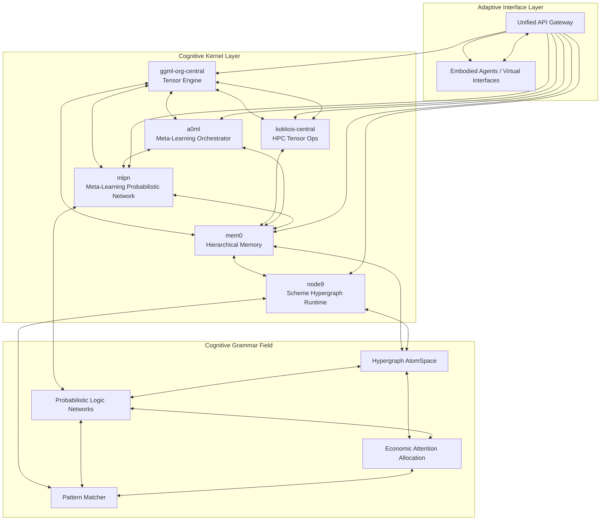

# Unified Cognitive Kernel Integration

## 🧠 Transcendent Cognitive Synthesis Architecture

The Unified Cognitive Kernel represents a groundbreaking implementation of distributed neural-symbolic cognition, integrating six major cognitive systems into a coherent, adaptive architecture:

- **a0ml** - Meta-learning orchestration and distributed task management
- **ggml-org-central** - Low-latency tensor computation engine
- **kokkos-central** - High-performance parallel computing operations
- **mem0** - Hierarchical memory system (episodic, semantic, temporal)
- **mlpn** - Meta-learning probabilistic networks
- **node9** - Scheme-based hypergraph runtime

## 🏗️ Architecture Overview



## 🔧 Core Components

### 1. Tensor Kernel Cohesion
Unified tensor operations across GGML, Kokkos, and A0ML backends with automatic backend selection and tensor interoperability.

**Key Features:**
- Low-latency tensor computation via GGML
- High-performance parallelization via Kokkos
- Meta-learning orchestration via A0ML
- Automatic tensor format conversion
- Performance-based backend selection

### 2. Cognitive Grammar Field
Implements hypergraph knowledge representation with probabilistic reasoning and pattern matching.

**Key Features:**
- AtomSpace hypergraph with prime-factorized addressing
- Probabilistic Logic Networks (PLN) for inference
- Pattern matching with cognitive templates
- Integration with Mem0 and Node9 memory systems

### 3. ECAN Attention Allocation
Economic Attention Allocation Networks for adaptive cognitive resource management.

**Key Features:**
- Economic model with wages, rents, and stimulus
- Attention spreading algorithms
- Dynamic focus management
- Performance-based adaptation

### 4. Tensor Shape Meta-Design
Prime factorization-based tensor addressing and gestalt field creation.

**Key Features:**
- Unique addressing via prime decomposition
- Lexeme generation for linguistic representation
- Gestalt tensor field synthesis
- Grammatical role assignment

### 5. Adaptive Interface Layer
Unified API gateway supporting multiple interface modalities.

**Key Features:**
- REST API for standard HTTP access
- gRPC for high-performance binary protocol
- WebSocket for real-time interaction
- Embodied agents (chatbot, virtual assistant, tutor)

## 🚀 Quick Start

### Basic Usage

```python
import asyncio
from unified_cognitive_kernel import UnifiedCognitiveKernel, CognitiveKernelConfig

async def main():
    # Configure the cognitive kernel
    config = CognitiveKernelConfig(
        tensor_kernel={
            'ggml_backend': 'cpu',
            'kokkos_execution_space': 'serial',
            'a0ml_meta_learning_enabled': True
        },
        memory_config={
            'hierarchical_levels': 3,
            'episodic_capacity': 10000,
            'semantic_capacity': 50000
        },
        attention_config={
            'ecan_enabled': True,
            'attention_decay': 0.95,
            'importance_threshold': 0.1
        }
    )
    
    # Initialize the kernel
    kernel = UnifiedCognitiveKernel(config)
    await kernel.initialize()
    
    # Execute a cognitive cycle
    input_data = {
        'cognitive_content': {
            'user_query': 'Explain machine learning',
            'context': 'educational',
            'cause': 'learning',
            'effect': 'understanding'
        },
        'tensor_data': {
            'query_embedding': np.random.randn(128)
        }
    }
    
    result = await kernel.cognitive_cycle(input_data)
    print(f"Cognitive response: {result}")
    
    # Shutdown
    await kernel.shutdown()

asyncio.run(main())
```

### Tensor Shape Meta-Design

```python
from unified_cognitive_kernel.tensor_shapes import TensorShapeMetaDesign, TensorCategory

# Create tensor meta-design system
tensor_meta = TensorShapeMetaDesign()

# Create component tensor shapes
ggml_shape = tensor_meta.create_tensor_shape((64, 32), TensorCategory.GGML_TENSOR)
mem0_shape = tensor_meta.create_tensor_shape((3, 3, 64, 128), TensorCategory.MEM0_TENSOR)

print(f"GGML shape: {ggml_shape.dimensions}")
print(f"Prime address: {ggml_shape.unique_address}")
print(f"Lexeme: {ggml_shape.lexeme_representation}")

# Create gestalt field
component_shapes = {'ggml': ggml_shape, 'mem0': mem0_shape}
gestalt_field = tensor_meta.create_gestalt_field(component_shapes)

print(f"Gestalt shape: {gestalt_field.shape}")
print(f"Coherence: {gestalt_field.coherence_measure}")
```

### ECAN Attention Allocation

```python
from unified_cognitive_kernel.attention_allocation import ECANAttentionAllocation

# Configure ECAN
config = {
    'attention_bank': 1000.0,
    'importance_decay': 0.95,
    'wage_scaling': 0.1,
    'rent_scaling': 0.05
}

ecan = ECANAttentionAllocation(config)
await ecan.initialize()

# Allocate attention based on reasoning results
reasoning_response = {
    'pattern_matches': [
        {'template': 'causal_relation', 'confidence': 0.8}
    ],
    'inferences': [
        {'premise_atoms': ['learning'], 'conclusion_atom': 'knowledge', 'confidence': 0.9}
    ]
}

allocation_result = await ecan.allocate_attention(reasoning_response, {})
print(f"Attention focus: {allocation_result['attention_focus']}")
```

## 🔢 Tensor Shape Examples

The system uses prime factorization for unique tensor addressing:

| Tensor Shape | Prime Factorization | Unique Address | Lexeme Representation |
|--------------|-------------------|----------------|----------------------|
| [64, 32] | [2^6, 2^5] | 2^11 | vector_verb_2^11 |
| [128] | [2^7] | 2^7 | scalar_noun_2^7 |
| [3, 3, 64, 128] | [3, 3, 2^6, 2^7] | 3^2_2^13 | tensor4d_preposition_3^2_2^13 |

## 🎯 Cognitive Cycle Process

1. **Tensor Processing** - Input processed through GGML/Kokkos/A0ML backends
2. **Pattern Matching** - Cognitive templates matched against input patterns
3. **PLN Inference** - Probabilistic reasoning generates new knowledge
4. **Memory Integration** - Results stored in Mem0 and Node9 systems
5. **Attention Allocation** - ECAN distributes cognitive resources
6. **Gestalt Update** - Unified tensor field updated with new state
7. **Response Generation** - Adaptive interface generates final response

## 🧪 Testing

Run the comprehensive test suite:

```bash
# Full test with external dependencies
python src/unified_cognitive_kernel/test_unified_kernel.py

# Simplified test without dependencies
python src/unified_cognitive_kernel/simplified_test.py

# Interactive demonstration
python src/unified_cognitive_kernel/demo.py
```

## 📊 Performance Metrics

The system tracks multiple performance dimensions:

- **Tensor Efficiency** - Throughput and memory utilization
- **Attention Effectiveness** - Distribution entropy and focus stability
- **Reasoning Accuracy** - Pattern matching and inference precision
- **Interface Quality** - Response quality and user satisfaction

## 🔧 Configuration Options

### Tensor Kernel Configuration
```python
tensor_kernel = {
    'ggml_backend': 'cpu',          # or 'gpu', 'metal'
    'ggml_threads': 4,              # Number of compute threads
    'ggml_memory_pool': 1024**3,    # Memory pool size in bytes
    'kokkos_execution_space': 'serial',  # or 'cuda', 'hip'
    'a0ml_meta_learning_enabled': True
}
```

### Memory Configuration
```python
memory_config = {
    'hierarchical_levels': 3,       # Number of memory hierarchy levels
    'episodic_capacity': 10000,     # Episodic memory capacity
    'semantic_capacity': 50000      # Semantic memory capacity
}
```

### Attention Configuration
```python
attention_config = {
    'ecan_enabled': True,           # Enable economic attention allocation
    'attention_decay': 0.95,        # Attention decay rate per cycle
    'importance_threshold': 0.1,    # Minimum importance for stimulus
    'attention_bank': 1000.0       # Total attention resources
}
```

## 🌟 Advanced Features

### Meta-Learning
The system includes adaptive meta-learning capabilities that optimize performance based on usage patterns:

```python
# Trigger meta-learning cycle
await kernel.meta_learning_cycle()

# Performance metrics automatically influence:
# - Attention allocation strategies
# - Tensor operation backend selection
# - Pattern matching sensitivity
# - Memory retention policies
```

### Embodied Agents
Multiple agent types are supported:

- **Chatbot** - Conversational AI with cognitive reasoning
- **Virtual Assistant** - Task-oriented agent with planning
- **Cognitive Tutor** - Educational agent with assessment
- **Robot Controller** - Embodied agent for physical interaction

### Prime-Factorized Addressing
Every tensor has a unique prime-factorized address enabling:

- Efficient tensor lookup and comparison
- Compositional tensor operations
- Gestalt field coherence measurement
- Linguistic representation generation

## 🔮 Future Extensions

The architecture is designed for extensibility:

1. **Additional Backends** - Integration with new tensor computation systems
2. **Enhanced Memory** - Integration with external knowledge bases
3. **Advanced Reasoning** - Integration with symbolic reasoning engines
4. **Distributed Deployment** - Multi-node cognitive kernel clusters
5. **Quantum Integration** - Quantum computing backend support

## 📚 Technical Documentation

For detailed technical documentation, see:

- `cognitive_kernel.py` - Main orchestration logic
- `tensor_kernel.py` - Tensor computation integration
- `cognitive_grammar.py` - Knowledge representation and reasoning
- `attention_allocation.py` - ECAN attention mechanisms
- `tensor_shapes.py` - Prime factorization and meta-design
- `adaptive_interface.py` - API gateway and agent interfaces

## 🤝 Contributing

To contribute to the Unified Cognitive Kernel:

1. Study the existing architecture and documentation
2. Identify areas for enhancement or new features
3. Implement changes following the established patterns
4. Add comprehensive tests for new functionality
5. Update documentation and examples

## 📄 License

This project is part of the co9priml cognitive architecture framework and follows the same licensing terms.

---

*The Unified Cognitive Kernel represents a new paradigm in artificial general intelligence, combining neural computation, symbolic reasoning, and economic resource allocation into a coherent, adaptive cognitive architecture.*